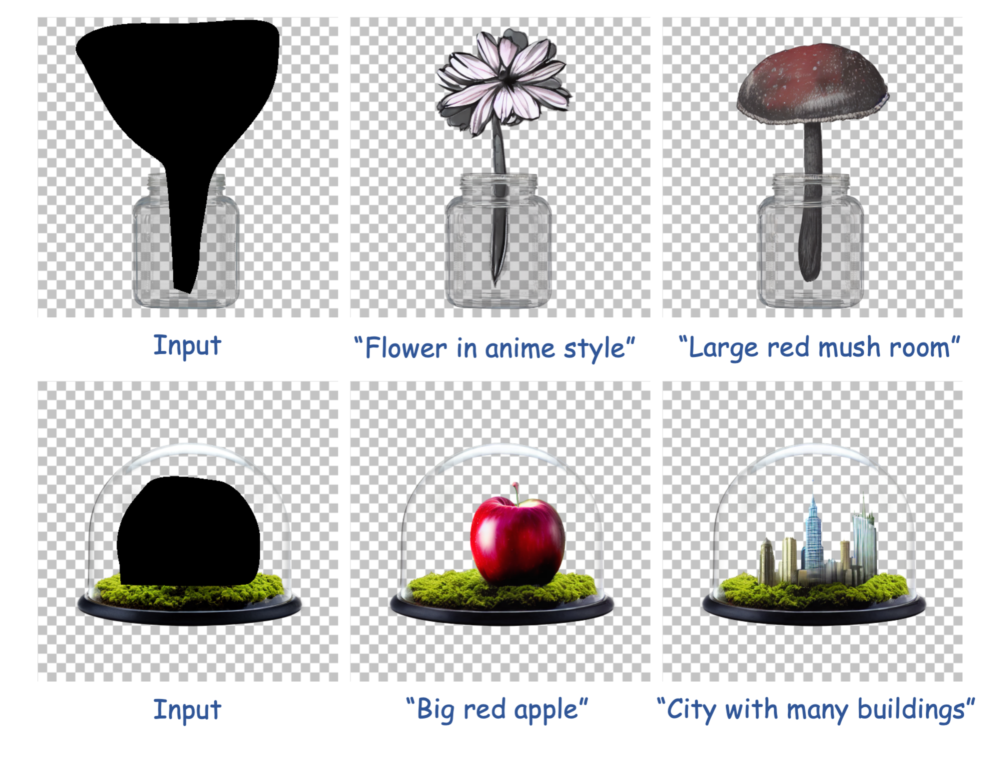

## Trans-Adapter: A Plug-and-Play Framework for Transparent Image Inpainting (ICCV2025)
Paper | [Project Page](https://ykdai.github.io/projects/trans-adapter) 

[Yuekun Dai](https://ykdai.github.io/), [Haitian Li](https://quest4science.github.io/), [Shangchen Zhou](https://shangchenzhou.com/), [Chen Change Loy](https://www.mmlab-ntu.com/person/ccloy/)

S-Lab, Nanyang Technological University

<p align="center">
  
</p>

Code will be released soon. Please stay tuned.

### Abstract

RGBA images, with the additional alpha channel, are crucial for any application that needs blending, masking, or transparency effects, making them more versatile than standard RGB images. Nevertheless, existing image inpainting methods are designed exclusively for RGB images. Conventional approaches to transparent image inpainting typically involve placing a background underneath RGBA images and employing a two-stage process: image inpainting followed by image matting. This pipeline, however, struggles to preserve transparency consistency in edited regions, and matting can introduce jagged edges along transparency boundaries. To address these challenges, we propose Trans-Adapter, a plug-and-play adapter that enables diffusion-based inpainting models to process transparent images directly. Trans-Adapter also supports controllable editing via ControlNet and can be seamlessly integrated into various community models. To evaluate our method, we introduce LayerBench, along with a novel non-reference alpha edge quality evaluation metric for assessing transparency edge quality. 

### Citation

If you find this work useful, please cite:

```
@article{transadapter2025,
  title     = {Trans-Adapter: A Plug-and-Play Framework for Transparent Image Inpainting},
  author    = {Dai, Yuekun and Li, Haitian and Zhou, Shangchen and Loy, Chen Change},
  journal   = {ICCV},
  year      = {2025},
}
```

### Contact

If you have any question, please feel free to reach me out at `ydai005@e.ntu.edu.sg`.
